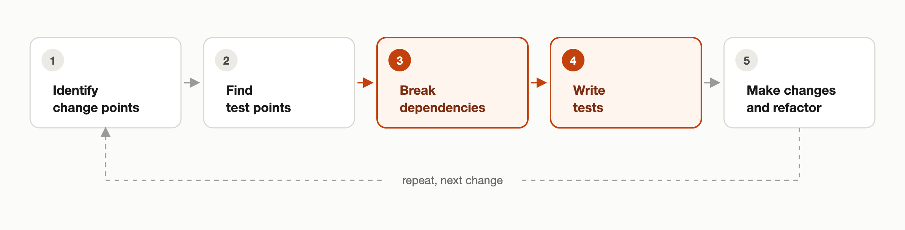

*How to safely change code when there are no tests to tell you what you broke.*

You open a file you did not write, six hundred lines, no tests, a constructor that opens a database connection, and a comment from 2014 that says `// do not touch this`. You have a one-line change to make, and it feels like surgery without anesthesia.

This post explains how to work with legacy code, based on Michael Feathers' *Working Effectively with Legacy Code*.

## What Is Legacy Code?

Legacy code is **code without tests**, not bad code, not old code, untested code.

The definition is deliberately unflattering and deliberately neutral. Code can be clean, well named, and elegantly factored, and still be legacy, because you have no way to know whether your change broke something. A tangled 600-line method with a solid suite around it is annoying, but it is not dangerous.

The distinction is not about quality but about feedback: "our codebase is bad" is a verdict on the people who wrote it, while "our codebase has no tests" is an engineering problem with known solutions.

## Seams

The catch is that untested code is usually untestable code. The class opens a socket in its constructor and reaches for a singleton halfway down, and a test has no way to substitute either one. Even the smallest version of the problem is hard to get around:

```java
public class OrderProcessor {
    // the dependency is welded in
    private final InventoryDatabase inventory = new InventoryDatabase();

    public void process(Order order) {
        inventory.reserveStock(order.getItemId(), order.getQuantity());
    }
}
```

That `new` fixes the type at compile time, and nothing outside the class gets a say in it. No caller can hand `OrderProcessor` a different inventory, so to test this you need a real database.

The way out is the **seam**: a place where you can alter behavior without editing in that place. Normally you change behavior by editing the code, but a seam lets you change it from somewhere else, leaving the original untouched. Every seam has an **enabling point**, the place where you make that swap.

In object-oriented code you can rely on polymorphism to create the seam. So you extract an interface, pass the dependency in through the constructor instead of creating it inside, and that parameter list becomes the enabling point:

```java
public interface Inventory {
    void reserveStock(String itemId, int quantity);
}

public class OrderProcessor {
    private final Inventory inventory;

    public OrderProcessor(Inventory inventory) {   // <-- enabling point
        this.inventory = inventory;
    }

    public void process(Order order) {
        inventory.reserveStock(order.getItemId(), order.getQuantity());
    }
}
```

Now the caller decides which inventory `OrderProcessor` gets, so a test can hand it a mock instead of a real database:

```java
@Test
void reserves_stock_for_the_ordered_item() {
    Inventory inventory = mock(Inventory.class);
    OrderProcessor processor = new OrderProcessor(inventory);

    processor.process(new Order("itemId", 3));

    verify(inventory).reserveStock("itemId", 3);
}
```

The class itself barely changed. What moved is who gets to decide, and once you see that, "this class is untestable" becomes "this class has no seam yet", a problem with a known fix.

## The Legacy Change Algorithm

It comes down to a repeatable procedure:

1. Identify your change points
2. Find the test points that cover them
3. Break the dependencies in the way
4. Write the tests
5. Only then make the change and refactor


**caption:** The Legacy Change Algorithm

People usually get this backwards, writing the test first and fighting the class every step of the way, when dependency-breaking should come first, since that is the real work and the test follows easily after.

Those tests are usually **characterization tests** rather than correctness tests, written by making an assertion you expect to fail, letting the failure show you what the code really does, then encoding that, so they say nothing about what the code should do, only what it does today, which is what lets you change it safely tomorrow.

## Anything Can Be Mocked in 2026

Every mainstream language now has a mocking library that reaches past the barriers Feathers had to work around by hand in 2004. Take Mockito 5 as the Java example: the inline mock maker is now the default, so static methods, final classes, and constructor calls are all mockable out of the box. That first `OrderProcessor`, with `new InventoryDatabase()` welded into it, is testable today without touching a line of it:

```java
try (MockedConstruction<InventoryDatabase> ignored =
             mockConstruction(InventoryDatabase.class)) {
    new OrderProcessor().process(order);
}
```

The seam is no longer required, which changes the argument but not the conclusion. That test is pinned to the fact that `OrderProcessor` calls `new InventoryDatabase()`, an implementation detail, so changing how the class gets its data breaks the test even though the behavior did not.

That kind of coupling is exactly what heavy static mocking lets you ignore, which is why it is widely treated as a smell. Difficulty testing something is design feedback telling you the code is too tightly coupled, and mocking anything away means you stop hearing it.

What you can do today is get the characterization test in with whatever mocking the language gives you, then put the seam in behind it and move the test onto the contract instead, since the seam is what keeps every test after the first one cheap.

## When You Do Not Have Time

Everything so far assumes you will eventually wrestle the class under test, but when the change is new behavior, you do not have to. **Sprout Method** is the answer: do not add new logic to untested code, sprout it into a new method that is tested from the start and call that from the old one.

Say `processOrder` lives in a class you cannot instantiate. Right now it ships every item on the order without checking stock, and you need it to skip anything that is out of stock:

```java
public void processOrder(Order order) {
    for (LineItem item : order.getItems()) {
        item.markShipped();
    }
    warehouse.dispatch(order);
}
```

The tempting move is an `if` inside the loop, one more untested branch in an untested class. Instead, sprout:

```java
public void processOrder(Order order) {
    List<LineItem> eligibleItems = eligibleForShipping(order);
    for (LineItem item : eligibleItems) {
        item.markShipped();
    }
    warehouse.dispatch(order);
}

// new, and tested on its own
List<LineItem> eligibleForShipping(Order order) {
    List<LineItem> result = new ArrayList<>();
    for (LineItem item : order.getItems()) {
        if (item.isInStock()) {
            result.add(item);
        }
    }
    return result;
}
```

The new method takes and returns plain data and touches nothing else, so you can develop it test-first. The old method picks up one new line and one changed line, and it is the new behavior, the part most likely to be wrong, that ends up covered. That is the shift worth remembering: making a safe change today does not require the whole class under test, only the new logic.

There is a real price here: the source method stays unimproved, and the class reads oddly for a while, one tested method sitting inside an untested one. Accept that rather than rush to fix it. The goal is not a perfect class in one pass, just one stable enough to keep improving.

## It Gets Worse Before It Gets Better

Say a team decides to stop making exceptions and actually start requiring coverage on the legacy code they touch. What nobody warns them about is that the first few weeks feel worse than doing nothing at all. Every change now carries dependency-breaking work that did not exist before, tickets that took an afternoon take two days, and somewhere around week two someone says the team was faster before all this testing. They are not wrong. The cost was always there, but you were paying it in fear and bug reports instead of visible hours on a board.

Things usually flip about a month in, with the second change to the same area: the seams are still broken open, the mocks still work, and last month's characterization tests still cover the paths you are touching, so you skip the setup and go straight to the change. More of the codebase becomes safe to touch, and it keeps growing from there.

## Takeaway

The book is from 2004, but its core idea has aged well: tests are worth investing in because they turn changing code from guesswork into feedback. Most of the specific techniques hold up too, especially the seam and Sprout Method, which still work on the days you cannot get an entire class under test.

Legacy code is scary because it lacks tests, and those same techniques are how you start closing that gap, one change at a time.
