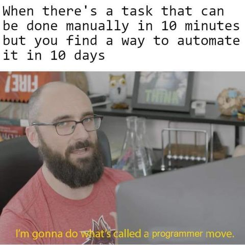
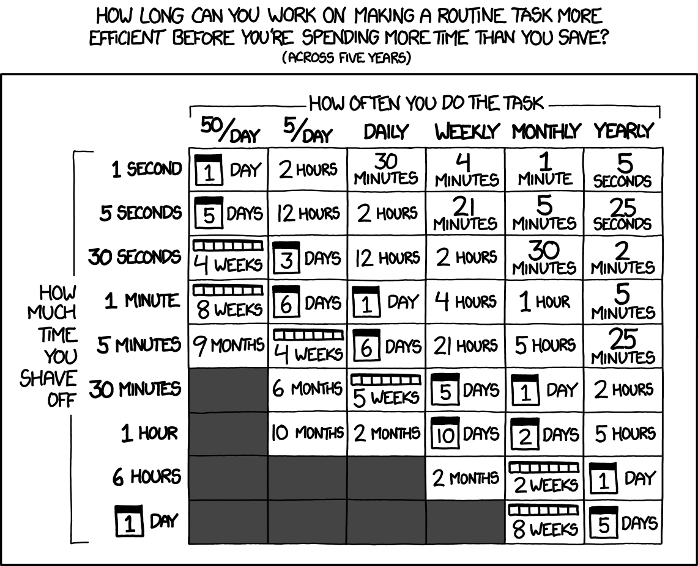
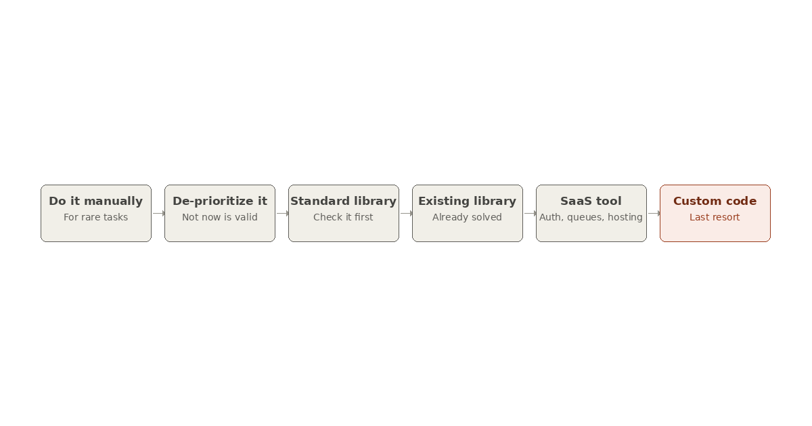

*Why every line you write is a liability, and what to do instead.*

Every developer knows the meme: a task can be done manually in ten minutes, so we spend ten days automating it instead. A true ["programmer move"](https://www.reddit.com/r/ProgrammerHumor/comments/17pmugu/programmermove/).


**caption:** A Programmer Move
**alt:** Programmer Move Meme

We laugh because we have all done it. But behind the joke sits one of the most important principles in software engineering, put into words by Jeff Atwood back in 2007 in the post that inspired this one: [The Best Code is No Code At All](https://blog.codinghorror.com/the-best-code-is-no-code-at-all/).

## Code Is a Liability, Not an Asset

We are trained to think of a codebase as something we *accumulate*, an asset that grows in value with every commit. Junior developers even measure their day in lines shipped: *"I wrote 500 lines today!"*

But flip the accounting around. Every line of code you write is a line that must be:

- **Read and understood** by teammates, by new hires, and by you in six months
- **Tested**, and the tests themselves are more code
- **Deployed**, with all the pipelines, environments, and rollbacks that implies
- **Maintained**, because dependencies rot, APIs get deprecated, and security patches pile up
- **Adjusted**, since every new feature has to coexist with everything that came before

None of that is free. More code means a larger surface area for bugs and vulnerabilities, longer onboarding for new developers, slower builds, and heavier cognitive load for everyone. A 10,000-line service is not ten times more valuable than a 1,000-line one. It is ten times more expensive to keep alive.

There is a line widely attributed to Bill Gates that captures this:

> "Measuring programming progress by lines of code is like measuring aircraft building progress by weight."

An aircraft does not get better as it gets heavier. Neither does your codebase. The *feature* is the asset. The code is the cost you paid to get it, and you keep paying it until someone finally deletes it.

Ken Thompson, co-creator of Unix, put the corollary beautifully:

> "One of my most productive days was throwing away 1,000 lines of code."

The best pull requests are often the ones with a negative line count.

## Ask First: Does Anyone Actually Need This?

Here is the part we skip far too often. Before asking *how* to build a feature, ask **whether it should exist at all**.

The cheapest feature to build, test, document, secure, and maintain is the one you never build. This is the spirit of the old agile principle **YAGNI** (*You Aren't Gonna Need It*), and it applies to product decisions just as much as to speculative abstractions in code.

Three questions worth asking before you open your editor:

1. **Does the user actually need this?** Or did it just sound cool in a planning meeting? Plenty of roadmap items survive on pure inertia. Nobody remembers *why*, only that it is "on the list."
2. **How rare is this case?** If the scenario comes up twice a year, a documented manual process beats an automated one. The famous xkcd chart ["Is It Worth the Time?"](https://xkcd.com/1205/) makes this concrete: it shows how long you can justify spending on automation based on how often the task recurs. A 30-second task that happens once a month justifies roughly *two hours* of work over five years. Not two weeks. Two hours.
3. **What is the opportunity cost?** Every day spent building feature A is a day not spent on feature B, which might be more urgent, more valuable, or both.


**caption:** Is It Worth the Time?
**alt:** Is It Worth the Time?

**Do the math before you do the work.**

To be fair, automation sometimes pays off in ways a time-saved chart cannot capture: it can eliminate human error, encode tribal knowledge, or teach you a skill you will reuse for years. The lesson is not "never automate." It is to be honest about *why* you are writing the code, and whether the outcome justifies the permanent maintenance bill attached to it.

## When You Cannot Avoid Code, Minimize It

Sometimes the feature genuinely is needed. Even then, "write custom code" should be the *last* option you reach for, not the first. Roughly in order:


**caption:** Roughly in order, from cheapest to most expensive to maintain.
**alt:** Diagram showing a six-step decision ladder before writing custom code: do it manually, de-prioritize it, use the standard library, use an existing library, use a SaaS or off-the-shelf tool, then write custom code as the last resort.

1. **Do it manually.** If it is rare enough, a checklist beats a codebase.
2. **De-prioritize it.** "Not now" is a valid and underrated engineering decision.
3. **Use the standard library.** Check before writing yet another utility function.
4. **Use an existing library or framework.** Someone has almost certainly solved this already, tested it, and hardened it against edge cases you have not imagined yet.
5. **Use a SaaS or off-the-shelf tool.** Running your own git server, auth system, or job queue is rarely the best use of your team's time.
6. **Write custom code.** Reluctantly, because you exhausted every other option.

## The Trap: Less Code Does Not Mean Fewer Characters

One important caveat, because this is where the mantra goes wrong. "Less code" means **less complexity**, not fewer keystrokes. Compressing logic into a clever one-liner, sometimes called "code golfing", does not reduce liability. It increases it:

```java
// "Clever": less code, MORE liability
double p = q > 10 ? t * 0.9 : t;

// Boring and readable: slightly more code, LESS liability
double finalPrice;
boolean qualifiesForBulkDiscount = quantity > 10;
if (qualifiesForBulkDiscount) {
    finalPrice = totalPrice * 0.9; // 10% bulk discount
} else {
    finalPrice = totalPrice;
}
```

Both apply a bulk discount. The first version is shorter, but the next developer will burn time decoding what `q`, `t`, and `0.9` mean. The real metric is not characters on disk. It is **how much a human has to read and understand to safely change the system**. This is not a contest of clever tricks to shrink physical space; it is about reducing the volume of code a programmer must absorb to understand how the program works.

## Your Job Is Not to Write Code

If there is one sentence to take away, it is this: **your job is to solve problems, not to produce code.** Code is just one tool, and the most expensive one on the shelf.

So the next time you are about to build something, pause and run the checklist:

- Can I eliminate this entirely?
- Can I solve it with a process instead of a program?
- Can I use something that already exists?
- If I must write it, what is the smallest, most boring version that works?

If you love writing code, really, truly love it, then love it enough to write as little of it as possible.
