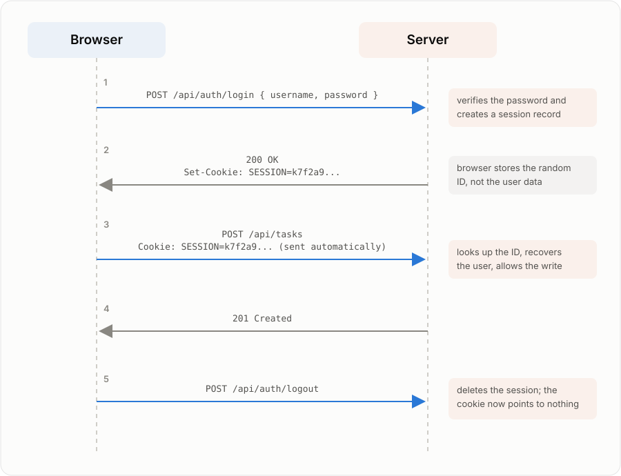
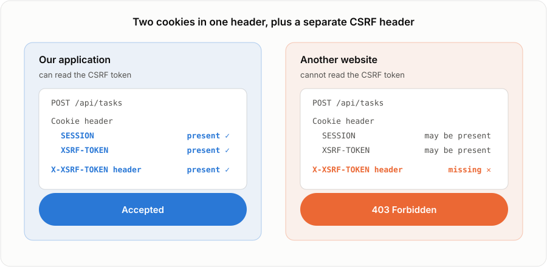
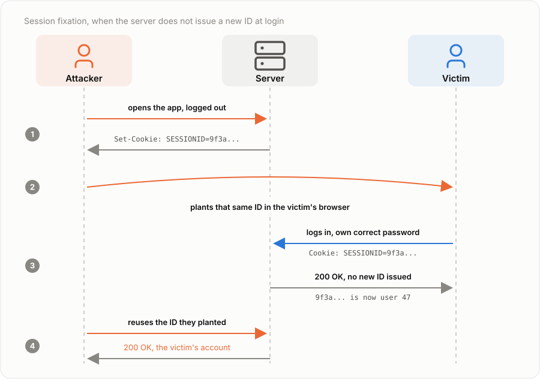
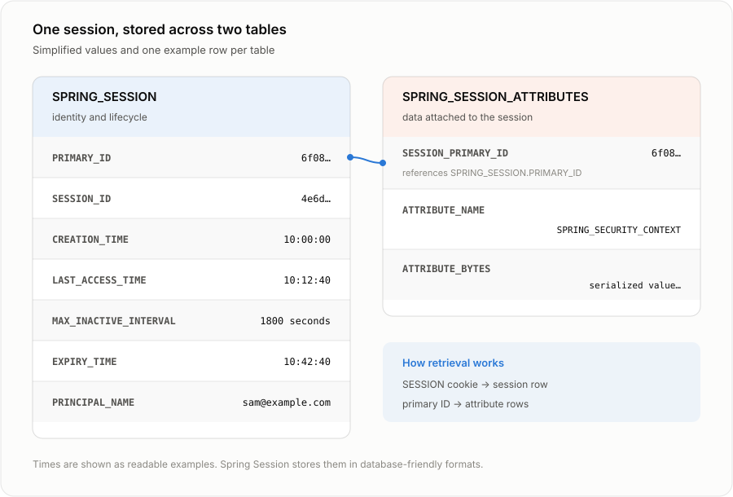
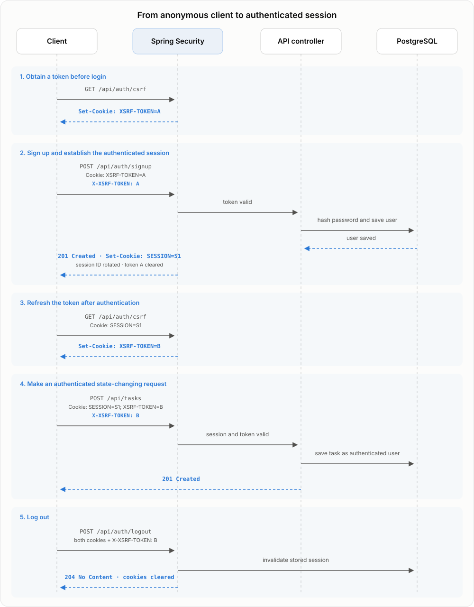

# Sessions: How the Web Remembers You

You log in to a website once. After that, you can open another page, refresh the browser, or call an API without entering your password again. Somehow, the application remembers that every new request is still coming from you.

HTTP does not provide that memory by itself. Each request is independent, so the server needs a way to connect the current request with the login that happened a moment ago. Session authentication does this by splitting the memory between the browser and the server: the browser keeps a random identifier, and the server keeps the information associated with it.

That is the basic idea: the browser carries a random ID, and the server uses it to recover the corresponding session. Its simplicity hides an important consequence, though. Possession of the ID is enough to use the session, so the application must protect that value as carefully as any other credential. We will follow the exchange from login to logout, then secure it against theft, forged cross-site requests, and session fixation. The demo implements the complete backend flow with Spring Security, Spring Session JDBC, and PostgreSQL, while `curl` makes each request and cookie visible.

## How sessions work

Three terms describe the mechanism:

- A **cookie** is a small value stored by the browser. In this flow, the server sends it in a response, and the browser automatically returns it in later requests that match the cookie's scope.
- A **session** is information the server keeps for one visitor, such as which user is signed in and when the login should expire.
- A **session ID** is a random value that connects the cookie to the session. The browser stores it in the cookie, and the server uses it to find the corresponding session.

The cookie is not the session itself. It is more like a claim ticket: the browser carries the ticket, while the useful information remains on the server. A typical session cookie contains only the random ID, not the username, password, roles, or other user data.

That random ID must still be treated as a credential. Anyone who obtains a valid value can present it to the server and use the associated session. Frameworks therefore generate unpredictable IDs with a cryptographically secure random source. Keeping the real state on the server also makes revocation immediate: deleting the session leaves the browser with a ticket that points to nothing.

### Session lifecycle

With those roles separated, the lifecycle becomes straightforward:

1. **The user logs in.** The browser sends the username and password to the server once.
2. **The server creates an authenticated session.** After verifying the password, it creates or rotates a random session ID and associates the signed-in user with it.
3. **The browser stores the ID.** The server returns a `Set-Cookie` response header, which is the instruction browsers use to create or update a cookie. The browser saves the session ID from that header.
4. **Later requests reuse the session.** The browser places the stored value in a `Cookie` request header automatically. The server uses its ID to recover the signed-in user before handling the request.
5. **Expiry or logout ends the session.** The server invalidates the session record. A cookie may remain in the browser for a while, but an ID without a live record no longer authenticates anyone.

Signup is a separate account-creation operation. An application may log the new user in automatically afterward, but it still starts the same session flow described above.


**caption:** One login, many reused requests, one logout. Ending the session means deleting the server-side record, not the cookie.

The two header names reflect their direction. The server uses `Set-Cookie` in its response to store the ID in the browser. The browser uses `Cookie` in later requests to return it:

```http
HTTP/1.1 200 OK
Set-Cookie: SESSION=4e6d...; Path=/; HttpOnly; SameSite=Lax

GET /api/tasks HTTP/1.1
Cookie: SESSION=4e6d...
```

### Session lifetime

A session should not remain valid forever. Sessions commonly use an idle timeout enforced by the server-side store rather than the browser. Each request refreshes the session's last-access time, while a configured period without activity causes it to expire.

The cookie and the server-side session can have different expiration times, but the server has the final say. Changing the cookie's visible expiration cannot extend the server-side record, and an unknown, expired, or revoked ID no longer authenticates the request.

## Protecting a session

The browser now has a cookie containing a session ID, and the server treats that ID as proof of an authenticated session. The server cannot tell who physically sent it. It only knows that the request contains a valid value.

That creates three different security questions:

- Can someone steal the ID and reuse it?
- Can another website cause the browser to send it without reading it?
- Could the ID have been known before the user logged in?

Each question leads to a different attack, and each attack requires a different defense.

### Session theft

The most direct attack is to obtain a valid session ID and replay it from another client. The attacker does not need the password because the server already associates that ID with an authenticated user.

A session ID can leak through injected JavaScript, usually through a vulnerability called cross-site scripting, or XSS. It can also leak through an unencrypted connection, logs, URLs, or an overly broad cookie scope. Several cookie attributes reduce that exposure:

- **HttpOnly blocks JavaScript from reading the cookie.** With `HttpOnly` enabled, the session cookie does not appear in `document.cookie`, so injected script cannot copy the ID and send it to another machine. The script can still make authenticated requests while it runs on the page, which is why this setting limits XSS damage rather than fixing XSS itself.
- **Secure keeps the cookie on HTTPS.** With `Secure` enabled, the browser sends the cookie only over encrypted HTTPS connections. Without it, an accidental plain HTTP request can expose the session ID in transit.
- **Path limits which URLs receive the cookie.** With `Path=/`, the browser may send the cookie to any URL on the current host. If that host contains unrelated applications, a narrower path such as `/api` reduces where the credential is exposed. `Path` is a routing control, not a strong security boundary, because scripts on the same origin can still interact across paths.

> **What is XSS?** Cross-site scripting is a vulnerability that lets attacker-controlled JavaScript run inside a trusted website. The browser treats that script as part of the website, so it can read page data and make requests with the user's permissions.

These attributes reduce the ways an ID can escape, but they cannot make a stolen value safe. Short session lifetimes limit how long it remains useful, and server-side revocation lets the application invalidate it immediately.

### Cross-site request forgery

An attacker does not always need to steal the session ID. They may be able to make the victim's browser use it on their behalf. This is cross-site request forgery, or CSRF.

#### What is a cross-site request?

Suppose you are signed in to `bank.example` and then visit `attacker.example` in another tab. The malicious page contains a form whose destination is `https://bank.example/transfer`. Submitting that form makes the browser send a request from one site to another, so it is a cross-site request.

Browsers allow many cross-site requests because links, forms, images, and other parts of the web depend on them. The same-origin policy usually prevents the malicious page from reading the response, but it does not prevent every request from being sent. Cookies belong to the request's destination, not to the page that initiated it. When the browser sends a request to `bank.example`, it checks which `bank.example` cookies qualify and attaches them automatically. The page at `attacker.example` does not need to know their values.

#### If `SameSite` blocks the cookie, why use a CSRF token?

`SameSite=Lax` tells the browser not to attach the session cookie to most requests that begin on another site. Without that cookie, the forged request reaches the server as a logged-out request and cannot act as the user. The browser still sends the cookie when the user follows an ordinary link to the application, so links from an email or search result continue to work normally.

So why add a CSRF token? Because the two protections perform different checks in different places:

- **`SameSite` is a browser check.** The browser decides whether to attach the session cookie.
- **The CSRF token is a server check.** The server rejects a state-changing request unless the frontend also supplies a value that an attacker cannot provide.

Using both means the application does not depend on one browser rule. `SameSite` blocks the common attack early, while the token checks any state-changing request that still reaches the server. This is why [OWASP treats `SameSite` as an extra layer of protection](https://cheatsheetseries.owasp.org/cheatsheets/Cross-Site_Request_Forgery_Prevention_Cheat_Sheet.html), not as a replacement for CSRF validation.

> **When might `SameSite` not help?** Browsers consider subdomains that share the same base domain to be the same site. For example, `app.example.com` and `old.example.com` are same-site. If the old subdomain is compromised, requests from it may pass the `SameSite` check. The CSRF token gives the server another check that does not rely on that distinction.

The server creates a random CSRF token and stores it in a second cookie that the frontend is allowed to read.

#### When does the browser receive the CSRF token?

A CSRF token is not automatically part of a session or login response. The application must provide a way for its own frontend to obtain one. A server-rendered application may place the token in the HTML, while a JSON API may expose a small endpoint that generates the token and sends its cookie.

Our demo uses `GET /api/auth/csrf`. The endpoint is public so the client can obtain a token before signup or login. This matters because login is also a state-changing request and should receive CSRF protection. Calling the endpoint causes Spring to generate a token and return it in the readable `XSRF-TOKEN` cookie. The client then copies that value into the `X-XSRF-TOKEN` header when it submits the login request.

After a successful login, Spring changes the authentication state and clears the previous CSRF token. The client therefore calls `/api/auth/csrf` again to receive a fresh token before its next state-changing request. The same refresh is needed after logout.

Making the endpoint public does not let an attacker obtain the victim's token. An attacker can request a token for their own browser, but the same-origin policy prevents their page from reading the token stored for the victim's application. The token also does not authenticate anyone by itself.

#### Why can the application add the CSRF header but the attacker cannot?

The server gives the browser a second cookie named `XSRF-TOKEN`. Unlike the session cookie, this cookie is deliberately readable by the application's JavaScript. Before the application sends a state-changing request, its frontend code reads the token and copies it into a header named `X-XSRF-TOKEN`.

A legitimate request therefore works like this:

1. The browser attaches the `SESSION` and `XSRF-TOKEN` cookies automatically.
2. The application's frontend reads `XSRF-TOKEN` and adds the same value to the `X-XSRF-TOKEN` header.
3. The server sees the expected header and accepts the request.

A forged request is different:

1. The browser may still attach both cookies automatically.
2. The malicious page cannot read cookies that belong to the application, so it does not know the token's value.
3. The browser does not create the `X-XSRF-TOKEN` header automatically, so the request arrives without it and the server rejects it.

> **Why can't the malicious page read the token?** Browsers isolate websites from one another through the same-origin policy. JavaScript running on `attacker.example` can read cookies available to `attacker.example`, but it cannot read cookies belonging to `bank.example`. Reading and sending are different actions: the malicious page may cause the browser to send a request to `bank.example`, and the browser may attach its cookies, but their values are never revealed to the malicious page. It is like asking a courier to deliver a sealed envelope without being allowed to open it.

The important difference is not which cookies are sent. It is whether the request contains the matching header that only the application's frontend can add.


**caption:** The two requests are identical until the last row, where only the application's own frontend can supply the header.

The CSRF token does not identify the user or create a session. Its value comes from being readable by the application's own frontend but hidden from pages on other origins. The check applies to requests that change data, while GET endpoints should remain read-only.

### Session fixation

A different risk appears during login if the server keeps the same session ID the browser used while anonymous. An attacker who already knows that ID can cause the victim's browser to use it and then wait for the victim to sign in. If the ID does not change after authentication, the attacker can reuse it to enter the victim's account without knowing the password.


**caption:** The attacker never learns the password. They only need the session ID to survive the login.

The defense is to replace the session ID after a successful login. The victim receives a new, unpredictable ID, while the old value known to the attacker never becomes an authenticated credential. Authentication frameworks usually perform this rotation automatically during their built-in login flow. A custom login endpoint must apply the same protection explicitly, and any CSRF token should also change when authentication succeeds.

## Building the demo

Our demo now puts these ideas into practice with a Spring Boot API. We will store sessions in PostgreSQL, set the attributes of the session cookie, configure Spring Security, implement login, use the authenticated user in our API, and inspect the complete exchange with `curl`.

### Store sessions in PostgreSQL

The browser stores only a session ID, so the server needs a session store that maps that ID to the corresponding data. On each request, Spring Session looks up the ID, reads the session, and refreshes its last-access and expiry times. Logout deletes the record, while expired records are no longer accepted.

A single backend instance can keep this data in memory, but every session disappears when the process restarts. The data is also unavailable to other instances, so a request routed to another server cannot recover the same session. Our demo stores sessions in PostgreSQL instead. The records survive backend restarts, and every instance connected to the database can retrieve them.

Spring Session uses two tables. `SPRING_SESSION` stores the session ID and lifecycle information, while `SPRING_SESSION_ATTRIBUTES` stores the values associated with that session. The attribute row references the session through its primary ID, allowing one session to hold multiple attributes without adding a column for each one.


**caption:** One session row, one attribute row per stored value, joined by the primary ID.

PostgreSQL is a practical choice here because the demo already depends on it. Applications with very high session traffic may use Redis instead, gaining fast shared access and native key expiry at the cost of operating another datastore. The browser contract remains the same either way: it sends a session ID, and the server retrieves the matching state.

### Set the session cookie attributes

Spring Boot writes the session cookie itself, so the attributes described earlier are configuration rather than code:

```yaml
server:
  servlet:
    session:
      cookie:
        name: SESSION
        http-only: true
        same-site: lax
        path: /
        secure: ${taskflow.cookie-secure}
      tracking-modes: cookie
```

`tracking-modes: cookie` keeps the session ID out of URLs, where it would otherwise reach browser history, server logs, and referrer headers. The demo leaves `taskflow.cookie-secure` false because the walkthrough runs over plain HTTP on `localhost`, and a `Secure` cookie would never be sent there. Any deployment reachable over HTTPS should set it to true. That is the one value here worth verifying per environment, because an application works perfectly well without it while its session ID travels in clear text.

### Configure Spring Security

Spring Security needs three pieces of information: how to verify a user, which requests require authentication, and what must change after a successful login. Keeping those responsibilities separate makes the configuration easier to follow.

#### How does Spring verify a user?

During signup, `UserService` hashes the submitted password with BCrypt and stores the resulting hash in the `users` table. The original password is never saved.

Login takes a different path. Spring Security uses `UserDetailsService` whenever it needs to load an account for authentication. When the login controller passes a username and password to `AuthenticationManager`, Spring calls `UserDetailsService` with that username. The service uses our `UserRepository` to find the account, then returns the username, stored password hash, and roles in the format Spring Security expects. `PasswordEncoder` tells Spring how to compare the submitted password with that stored BCrypt hash.

```java
@Bean
public PasswordEncoder passwordEncoder() {
    return new BCryptPasswordEncoder();
}

@Bean
public UserDetailsService userDetailsService(UserRepository users) {
    return username -> users.findByUsername(username)
            .map(account -> User.withUsername(account.getUsername())
                    .password(account.getPasswordHash())
                    .roles("USER")
                    .build())
            .orElseThrow(() -> new UsernameNotFoundException(username));
}
```

Spring combines these two beans during authentication. `UserDetailsService` finds the account, and `PasswordEncoder` hashes and compares the submitted password using BCrypt's verification process. The database can only return the stored hash because the original password was hashed before it was saved and is not stored as plain text.

#### Which requests are protected?

`SecurityFilterChain` defines the rules for every request under `/api`:

```java
@Bean
public SecurityFilterChain apiChain(HttpSecurity http) {
    http
            .securityMatcher("/api/**")
            .csrf(CsrfConfigurer::spa)
            .authorizeHttpRequests(auth -> auth
                    .requestMatchers("/api/auth/signup", "/api/auth/login", "/api/auth/csrf")
                    .permitAll()
                    .anyRequest().authenticated())
            .formLogin(AbstractHttpConfigurer::disable)
            .httpBasic(AbstractHttpConfigurer::disable)
            .exceptionHandling(ex -> ex.authenticationEntryPoint(
                    new HttpStatusEntryPoint(HttpStatus.UNAUTHORIZED)))
            .logout(logout -> logout
                    .logoutUrl("/api/auth/logout")
                    .logoutSuccessHandler((request, response, authentication) ->
                            response.setStatus(HttpStatus.NO_CONTENT.value())));
    return http.build();
}
```

The configuration establishes five rules:

- The chain applies only to `/api/**`.
- Signup, login, and the endpoint that issues a CSRF token do not require an existing session. Every other API endpoint does.
- Spring's SPA-oriented CSRF protection checks requests that may change data. `permitAll()` removes the authentication requirement from signup and login, but it does not remove their CSRF check.
- A request without a valid session receives `401 Unauthorized` instead of being redirected to an HTML login page.
- A CSRF-protected `POST /api/auth/logout` invalidates the session and returns `204 No Content`.

The API accepts JSON rather than serving a login page, so Spring's HTML form login and the browser's HTTP Basic prompt are both disabled. Keeping authorization and logout in the filter chain gives every controller the same rules without requiring each endpoint to implement them independently.

SPA means single-page application: a browser application whose JavaScript calls a backend API instead of loading a new HTML page for every action. Spring's SPA-oriented configuration stores the CSRF token in a readable cookie and expects the frontend to return it in a header.

Spring does not inspect an endpoint's code to decide whether it changes data. It uses the HTTP method. `POST`, `PUT`, `PATCH`, and `DELETE` require a CSRF token because they may change state. Safe methods such as `GET`, `HEAD`, `OPTIONS`, and `TRACE` do not. This rule depends on the application following HTTP semantics, so a GET endpoint must never change data.

The public CSRF endpoint gives a new client a token before it can send a protected POST request:

```java
@GetMapping("/csrf")
public CsrfToken csrf(CsrfToken token) {
    return token;
}
```

Resolving the `CsrfToken` argument makes Spring generate the token and write the readable `XSRF-TOKEN` cookie configured by `spa()`. The client calls this endpoint when it starts and again after login or logout, because those operations clear the previous token.

#### What changes after login?

Two values must change after successful authentication: the session ID and the CSRF token. `SessionAuthenticationStrategy` groups those operations together:

```java
@Bean
public SessionAuthenticationStrategy sessionAuthenticationStrategy() {
    return new CompositeSessionAuthenticationStrategy(List.of(
            new ChangeSessionIdAuthenticationStrategy(),
            new CsrfAuthenticationStrategy(
                    CookieCsrfTokenRepository.withHttpOnlyFalse())));
}
```

`ChangeSessionIdAuthenticationStrategy` replaces the pre-login session ID to prevent session fixation. `CsrfAuthenticationStrategy` replaces the CSRF token so a value issued before login does not survive into the authenticated session.

Spring invokes these protections automatically during its built-in login flow. TaskFlow uses a custom JSON login endpoint instead, so the controller must invoke the combined strategy explicitly. That is the bridge from configuration to the login method.

### Implement API login

The client logs in by sending the credentials to `POST /api/auth/login` as JSON:

```http
POST /api/auth/login HTTP/1.1
Content-Type: application/json

{
  "username": "sam@example.com",
  "password": "secret"
}
```

Signup first stores a BCrypt password hash through `UserService`, then calls the same `authenticate` method as login so both endpoints create sessions in exactly the same way.

The controller needs an entry point into Spring's authentication system. The configuration exposes the `AuthenticationManager` that Spring builds from the `UserDetailsService` and `PasswordEncoder` shown above:

```java
@Bean
public AuthenticationManager authenticationManager(AuthenticationConfiguration config) {
    return config.getAuthenticationManager();
}
```

The method turns those submitted credentials into a session-backed login:

```java
private CurrentUser authenticate(Credentials credentials,
                                 HttpServletRequest request,
                                 HttpServletResponse response) {
    Authentication authRequest = UsernamePasswordAuthenticationToken
            .unauthenticated(credentials.getUsername(), credentials.getPassword());
    Authentication authResult = authenticationManager.authenticate(authRequest);

    sessionStrategy.onAuthentication(authResult, request, response);

    SecurityContext context = SecurityContextHolder.createEmptyContext();
    context.setAuthentication(authResult);
    SecurityContextHolder.setContext(context);
    contextRepository.saveContext(context, request, response);

    return CurrentUser.builder()
            .username(authResult.getName())
            .build();
}
```

`UsernamePasswordAuthenticationToken.unauthenticated(...)` wraps the submitted username and password in an authentication request. Despite its name, this object does not mean the user is signed in. `AuthenticationManager` uses the `UserDetailsService` and `PasswordEncoder` configured above to load the account and check the password. A failed comparison rejects the login; a match returns an authenticated `Authentication` representing the verified user.

The method then passes that verified result to `sessionStrategy`. This is the point where the session ID and CSRF token are replaced, preventing values known before login from surviving into the authenticated session. The strategy protects the session, but it does not store the signed-in user by itself.

The `SecurityContext` holds the authenticated user. Placing it in `SecurityContextHolder` makes it available during the current request, while `contextRepository.saveContext(...)` writes it into the session so Spring Security can restore it on later requests. Without that final save, the password check would succeed but the next request would still be anonymous.

Finally, the method returns only the verified username for the client to display. The password is discarded, and the session ID reaches the browser through the `Set-Cookie` response header rather than the JSON body.

### Trust the authenticated user

Once the filter chain restores the context, controllers can receive the current `Authentication`. Task creation uses that authenticated name instead of trusting a username supplied by the client:

```java
@PostMapping
@ResponseStatus(HttpStatus.CREATED)
public TaskResponse create(@RequestBody NewTask body,
                           Authentication authentication) {
    Task task = tasks.create(body.getTitle(), authentication.getName());
    return TaskResponse.from(task);
}
```

`TaskController` belongs to the `api` package and delegates the business operation to `TaskService` in `core`. The service depends on a core `TaskRepository` interface, while `JpaTaskRepository` in `infra` implements that interface and maps between `Task` and `TaskEntity`. This keeps the business layer independent of JPA while still using Spring Data for persistence.

It also enforces a small but important trust-boundary rule. A browser may submit a task title, but it may not decide which user created the task. Identity comes from the server-validated context, so changing the request body cannot impersonate another account.

Listing tasks stays deliberately plain: `GET /api/tasks` returns every stored task to any authenticated caller. Deciding which user may see which task is authorization rather than authentication, so the demo keeps that rule out of the picture.

### Follow the complete request sequence

The complete flow now has a visible rhythm: obtain a CSRF token, use it to sign up or log in, obtain a fresh token after authentication, and send both cookies plus the CSRF header on later state-changing requests.


**caption:** The complete demo flow, from the first CSRF token to the invalidated session at logout.

The diagram labels `Cookie` as automatic because a browser attaches matching cookies itself. Copying `XSRF-TOKEN` into `X-XSRF-TOKEN` is a client responsibility. The demo README reproduces the same sequence with `curl`, where a cookie jar stands in for the browser's cookie storage.

### Run the demo

The full code is [on GitHub](https://github.com/SalimMersally/blog-post/tree/main/understanding-authentication/01-sessions-cookies/demo). Start PostgreSQL, run the Spring Boot API with `./gradlew bootRun`, and follow the `curl` walkthrough in the demo README. The exercises let you inspect the `spring_session` table, remove the CSRF header and observe a `403`, restart the backend without losing the session, and verify that logout makes `/api/auth/me` return `401`.

## When to use sessions

Sessions are a strong fit when a browser frontend and backend belong to the same product and the backend can maintain shared state. They give that product a straightforward model: the browser carries an identifier, while the backend remains responsible for the login and its lifetime. For many traditional web applications, that is all the architecture needs.

The choice changes when the clients and boundaries change. Native applications, public APIs, third-party integrations, and service-to-service communication may benefit from mechanisms designed for portable credentials, delegated access, or independent verification. Understanding those alternatives starts with the problem each one solves, not with the assumption that one approach universally replaces sessions.
